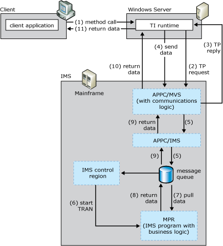

# IMS LU6.2 User Data
The IMS LU6.2 programming model provides access to IMS transactions using LU6.2.  
  
 The following figure summarizes the workflow occurring between the client, the default IMS Listener, and the mainframe transaction program. The numbers in parentheses indicate the approximate order in which events occur. A more detailed description of the events follows the figure.  
  
   
Transaction Integrator sending and receiving LU 6.2 from MVS/APPC, which then sends and receives from the IMS message queue  
  
 **Summary workflow diagram for the IMS LU6.2 User Data programming model**  
  
 The IMS LU6.2 programming model works as follows: An application invokes a method in a TI .NET object.  
  
1.  The TI runtime calls the TI Automation proxy.  
  
2.  The TI proxy:  
  
    1.  Reads in the assembly and meta data created previously by the TI Designer.  
  
    2.  Maps the .NET Framework data types to COBOL data types.  
  
3.  The TI Automation proxy then:  
  
    1.  Calls the conversion routines to convert the application data to mainframe COBOL types.  
  
    2.  Builds the flattened data stream buffer that represents the COBOL declaration or copybook.  
  
    3.  Passes the message to the SNA transport component.  
  
4.  The TI Automation proxy sends the transaction execution request (TER) and the user data to MVS APPC through the IBM-supplied multiple virtual storage/advanced program-to-program communications (APPC/MVS) application.  
  
5.  APPC/MVS application instructs IMS to place the transaction execution request and user data on the IMS message queue.  
  
6.  IMS schedules the server TP into a message processing region (MPR).  
  
7.  After execution begins, the TP issues a DL/I Get Unique (GU) command to get the input parameters that were sent by the TI runtime. If there is an input unbounded record set, the TP also makes one or more Get Next (GN) calls to get each row of the record set that was sent.  
  
8.  After the TP processes the inputs and makes any database calls, it makes one or more Insert (ISRT) calls to place the output parameters and possibly an output or return-value unbounded recordset into the IMS message queue to be packaged and returned to the TI runtime through the APPC/MVS application.  
  
9. The TI Automation proxy receives the reply data and processes the reply. The TI proxy:  
  
10. receives the message from the SNA transport component.  
  
11. reads the message buffer  
  
12. maps the COBOL data types to the .NET Framework data types  
  
13. calls the conversion routines to convert the mainframe COBOL types to the application data  
  
14. The TI runtime sends the converted data back to the .NET Framework application that invoked the method.  
  
 [!INCLUDE[hisHostIntServNoVersion](../includes/hishostintservnoversion-md.md)] includes sample code showing how to implement the IMS LU6.2 User Data programming model. The sample code is located at **\\***installation directory***\SDK\Samples\AppInt**. Start Microsoft Visual Studio, open the tutorial you want to use, and follow the instructions in the **Readme**.  
  
## See Also  
 [Transaction Integrator Components](../core/transaction-integrator-components1.md)    
 [Converting Data Types from Automation to OS/390 COBOL\]](./converting-data-types-from-automation-to-os-390-cobol]2.md)   
 [Converting Data Types from OS/390 COBOL to Automation](./converting-data-types-from-os-390-cobol-to-automation2.md)   
 [IMS Components](../core/ims-components2.md)   
 [TI Runtime](../core/ti-runtime2.md)   
 [Choosing the Appropriate Programming Model](../core/choosing-the-appropriate-programming-model1.md)   
 [Programming Models](../core/programming-models2.md)